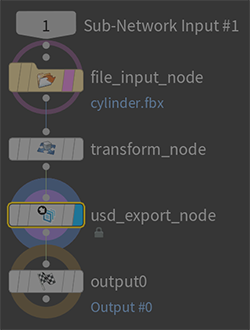
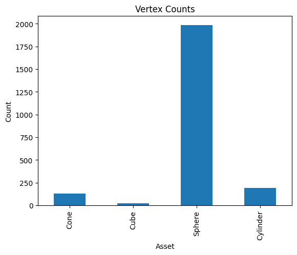

# USD asset pipeline
Practice project for managing and processing digital assets. The goal of this project is to simulate a production environment that transforms digital assets into the USD file format and performs ETL (Extract, Transform, Load) workflows with an emphasis on preparing data sets for machine learning.

## ETL workflow
1. A `.zip` archive containing geometry is extracted and primed for transformation in the `in` directory.
2. The files in the `in` directory are converted (i.e. transformed) and the resulting files are stored in the `out` directory.
3. *WIP:* the files are loaded into some kind of target archive or database

### FBX to USD
Converts `.fbx` files into `.usd` files using a Houdini Digital Asset. This process runs in a headless Houdini `hython` session.
The files are loaded by inserting their paths into the HDA file input parameter. The geometry is then transformed and scaled to Houdini units. The scale value can be adjusted as an input parameter. The result is exported again in `.usd` file format using the final output path parameter.

## Data Prep
The geometry files are analysed by the `open3d` Python library to extract metadata such as vertex count and bounding box dimensions.
The metadata is then compiled and stored as a list in a `.json` file. The data is visualised using Jupyter.

