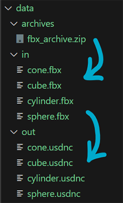

# USD asset pipeline
Practice project for managing and processing digital assets. The goal of this project is to simulate a production environment that transforms digital assets into the USD file format and performs ETL (Extract, Transform, Load) workflows with an emphasis on preparing data sets for machine learning.

## ETL workflow
1. A `.zip` archive containing geometry is extracted and primed for transformation in the `in` directory.
2. The files in the `in` directory are loaded into a headless Houdini `hython` session and transformed into the `.usd` format using a *Houdini Digital Asset*. The resulting files are stored in the `out` directory.
3. *WIP:* the files are loaded into some kind of target archive or database

## Data Flow

## TODO:
- compile a useful data set for machine learning purposes.
- setup Jupyter notebook to visualise data
